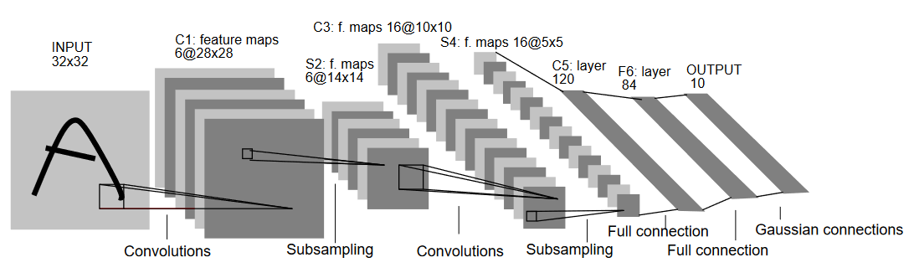
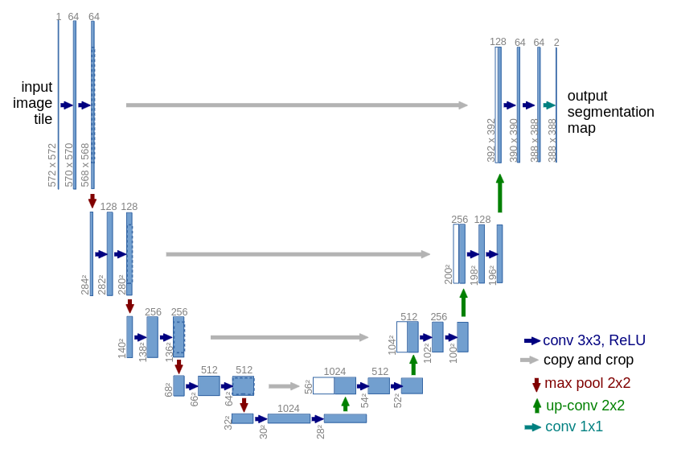
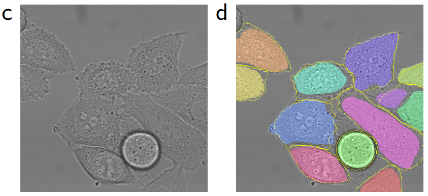

# Computer vision

TODO

### Contents

1.  [Convolutions](#convolutions)
2.  [LeNet](#lenet)
3.  [AlexNet](#alexnet)
4.  [ResNet](#resnet)
5.  [UNet](#unet)
6.  [Diffusion](#diffusion)
7.  [Conclusion](#conclusion)

## Convolutions

-   The most import operation in computer vision is a convolution.
-   It is a matrix multiply that respects spacial symmetry; the same matrix is applied everywhere.

-   Dumoulin, V. & Visin, F. (2016). [A guide to convolution arithmetic for deep learning](https://arxiv.org/abs/1603.07285).

## LeNet

-   LeCun, Y. et al. (1989). [Backpropagation applied to handwritten zip code recognition](https://web.archive.org/web/20150611222615/http://yann.lecun.com/exdb/publis/pdf/lecun-89e.pdf).
-   LeCun, Y., Bottou, L., Bengio, Y., & Haffner, P. (1998). [Gradient-based learning applied to document recognition](http://vision.stanford.edu/cs598_spring07/papers/Lecun98.pdf).
-   Used the [MNIST dataset](https://en.wikipedia.org/wiki/MNIST_database): handwritten digits 0-9
-   Used for Optical Character Recogition (OCR) on checks and mail in the 1990s!
-   This is arguably the first impactful application of deep learning?

## AlexNet

-   Other important labeled image datasets are CIFAR-10 and CIFAR-100 that have 10 and 100 classes, respectively.
-   Deng, J. et al. (2009). ImageNet: A large-scale hierarchical image database.
    -   ImageNet-1k dataset: 1000 image classes with about 1000 examples each.
-   Krizhevsky, A., Sutskever, I., & Hinton, G. E. (2012). [ImageNet classification with deep convolutional neural networks](https://papers.nips.cc/paper/4824-imagenet-classification-with-deep-convolutional-neural-networks.pdf).
    -   Became known as "AlexNet"
-   *Watershed moment in CV with deep learning*

## ResNet

ResNet v1 vs v2 ([cv-tricks.com](https://cv-tricks.com/keras/understand-implement-resnets/)):

.](img/resnet-v1-vs-v2.png)

-   He, K. et al. (2015). [Deep residual learning for image recognition](https://arxiv.org/abs/1512.03385).
-   Still an important MLPerf benchmark.

## UNet

The UNet architecture:

An example of image segmentation with UNet:

-   Ronneberger, O., Fischer, P., & Brox, T. (2015). [U-Net: Convolutional networks for biomedical image segmentation](https://arxiv.org/abs/1505.04597).

## Diffusion

TODO

## Conclusion

TODO

--------

-   Up next: [Natural language](natural-language.md)
-   Previous: [Introduction](introduction.md)

