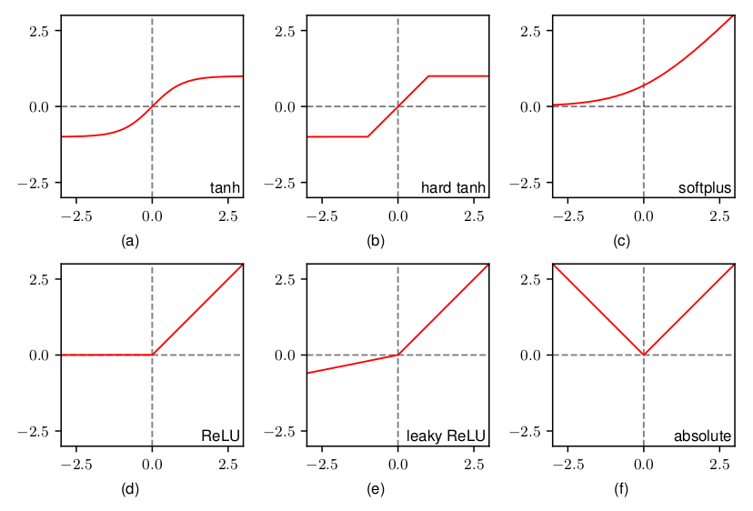
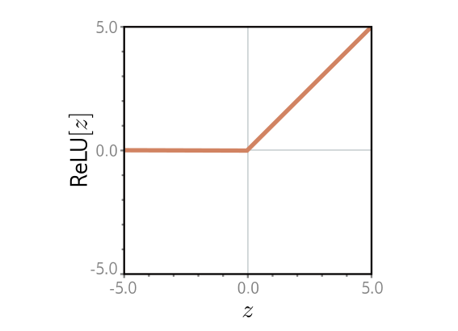
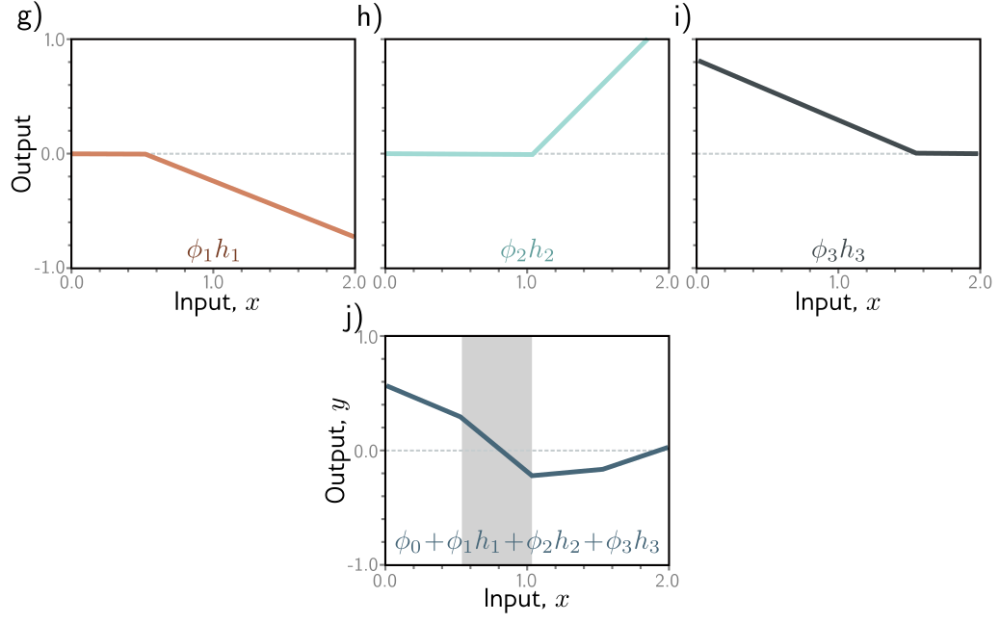
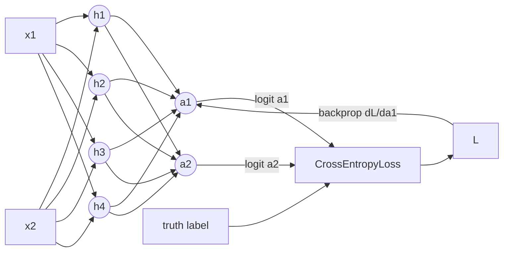

# Introduction

)](img/AI_vs_ML_vs_DL_Venn_Diagram.png)

1.  *Artificial Intellegence* is any kind of software that makes intellegent decisions in some sense.
    This could be a simple as hard-coded expert heuristics.
    Simple example: thermostat.
2.  *Machine Learning* is a kind of software that somehow improves (is *trained*) when given data.
    Expert knowledge is often used to structure the model and what features of the data are used.
    Simple example: Least squares fit to a linear model.
3.  *Deep Learning* is a recent paradigm of machine learning using large artificial neural networks,
    with many layers for feature learning. Models are more of a blackbox that learn features from the raw data.

In the general machine learning setup you have a model that can be
thought of as a parameterized function, $f$,
that takes in some vector of input data $\vec{x}$,
and returns some prediction $y$.
Internally the model is parameterized by weights, $\vec{w}$.

$$ y = f(\vec{x}; \vec{w}) $$

In the setting of *supervized learning*, then we training dataset
that has pairs of input samples, $\vec{x}$, and the true *label*
of what the prediction should be $\tilde{y}$.

## Layers of a network are matrix-function sandwiches

Neural network layer:

$$ y_i = \phi(z_i) = \phi(w_{ij} x_{j} + b_{j}) $$

A multi-layer neural network is a composition of functions.

$$ f(\vec{x}; \vec{w}) = f_n \circ \ldots f_2 \circ f_1(\vec{x}) = \phi_{n}( \ldots \phi_{2}(W_2 \phi_{1}(W_1 \vec{x} + \vec{b}_1 ) + \vec{b}_2) \ldots ) $$

](img/nn-as-function-composition.png)

There are a variety of nonlinear functions used in practice.

Note that we need the *activation function*, $\phi$, to add a nonlinearity,
because otherwise, if every layer was just linear matrix multiply, then
the layers could be effectively reduced to one:

$$ \vec{y} = W_{n} \ldots W_{2} W_{1} \vec{x} = W \vec{x} $$

See also:

-   Bishop, C.M. (2024). [*Deep Learning: Foundations and Concepts*](https://www.bishopbook.com/).
-   Bradley, T.D. (2019). [Matrices as tensor network diagrams](https://www.math3ma.com/blog/matrices-as-tensor-network-diagrams).

## Neural networks are universal function approximators

Neural networks need nonlinearities. ReLU is a simple example.

A neural network that uses ReLU acivations is a piecewise linear function.

&rArr; Neural networks are *universal function approximators*.

-   Hornik, K., Stinchcombe, M., & White, H. (1989). [Multilayer feedforward networks are universal approximators](https://cognitivemedium.com/magic_paper/assets/Hornik.pdf).
-   Prince, S.J.D. (2023). [*Understanding Deep Learning*](https://udlbook.github.io/udlbook/).

## Softmax classification

TODO

See also:

-   Roelants, P. (2019). [Softmax classification with cross-entropy](https://peterroelants.github.io/posts/cross-entropy-softmax/).

## Gradient descent

](img/stochastic-gradient-descent.jpg)

The workhorse algorithm for optimizing (training) model parameters is *gradient descent*:

$$ \vec{w}[t+1] = \vec{w}[t] - \eta \frac{\partial L}{\partial \vec{w}}[t] $$

In *Stochastic Gradient Descent* (SGD), you chunk the training data into *minibatches* (AKA batches),
$\vec{x}_{bt}$,
and take a gradient descent step with each minibatch:

$$ \vec{w}[t+1] = \vec{w}[t] - \frac{\eta}{m} \sum_{i=1}^m \frac{\partial L}{\partial \vec{w}}[\vec{x}_{bt}] $$

where

-   $t \in \mathbf{N}$ is the *learning step number*
-   $\eta$ is the *learning rate*
-   $m$ is the number of samples in a minibatch, called the *batch size*
-   $L$ is the *loss function*
-   $\frac{\partial L}{\partial \vec{w}}$ is the *gradient*

Notice that the gradient will be more noisey when the batch size is small.
One might think this is bad, but in a lot of cases it turns out to help to have some noise
in the gradient as a *regularizer*.
*Regularization* is basically any technique that helps a model generalize, get better evaluation error.
There is a ton of literature about how to change the learning rate with batch size.

There are many additions to SGD that are used in state-of-the-art optimizers:

-   SGD with momentum
-   RMSProp
-   Adam, AdamW
-   ...

Advanced optimizers add parameters that add to memory overhead.

## Backpropagation

How do we calculate $\frac{\partial L}{\partial w_{i}}$?

[Chain rule of calculus, case of scalar-valued functions with multiple inputs](https://en.wikipedia.org/wiki/Chain_rule#Case_of_scalar-valued_functions_with_multiple_inputs):

$$ \frac{d}{d x} f\left( g_1(x), \ldots, g_k(x) \right) = \sum_{j=1}^{k} \frac{\partial f}{\partial g_j} \frac{d g_j}{dx} $$

Using this to write the gradient with respect to some parameter:

$$ \frac{\partial L}{\partial w_i} = \sum_{j} \frac{\partial L}{\partial a_j} \frac{\partial a_j}{\partial w_i} = \sum_j \delta_j \frac{\partial a_j}{\partial w_i} $$ 

where

-   $\frac{\partial L}{\partial w_i}$ is the gradient
-   $a_j$ is the *activation* at that layer
-   $\delta_j \equiv \frac{\partial L}{\partial a_j}$ is the *delta* at that layer
-   $\frac{\partial a_j}{\partial w_i}$ is the rest of the derivative in following layers, recursively using the chain rule

In general, training involves:

1.  *Forward pass*: Calculate the inference of the model: $y = f(x; w)$, caching the activations, $a_j$, along the way
2.  *Loss*: $L$ (e.g. cross entropy)
3.  *Backward pass*: $\delta_j = \frac{\partial L}{\partial a_j}$
4.  *Weight update*: $-\eta \frac{\partial L}{\partial w_i}$

See also:

-   [Automatic differentiation](https://en.wikipedia.org/wiki/Automatic_differentiation) - "autograd"
-   [Backpropagation](https://en.wikipedia.org/wiki/Backpropagation)
-   Johnson, J. (2017). [Backpropagation for a linear layer](https://cs231n.stanford.edu/handouts/linear-backprop.pdf).
-   Parr, T. & Howard, J. (2018). [The matrix calculus you need for deep learning](https://arxiv.org/abs/1802.01528).

## Double descent

Example training and test loss curves for a single training experiment:

.](img/train-test-loss-curve.png)

*Early stopping* is a method of picking the optimally trained model
by stopping training when the test loss is at a minimum.

Now thinking about what happens if we do additional experiments with larger models.
Note that in the following plot, the curves are not losses for single experiments,
but the final losses for many different experiments with increasing model sizes.

In the tradditional way of thinking about overfitting, the rising test loss with
model complexity is part the [bias-variance tradeoff](https://en.wikipedia.org/wiki/Bias%E2%80%93variance_tradeoff).

).](img/Bias_and_variance_contributing_to_total_error.png)

But what is actually observed with increasing model size, is that the test
loss goes down again.

.](img/Nakkiran2019-double-descent.png)

Thought of as a function of the size of the model,
in the the classical machine learning regime
($n_\mathrm{param} \ll n_\mathrm{data}$),
there is an optimal model size that minizes test loss.
At larger model sizes, in the critical regime
($n_\mathrm{param} \sim n_\mathrm{data}$),
the test loss rises again as part of the high-variance
part of the classical bias-variance tradeoff.
But at larger model sizes,
($n_\mathrm{param} \gg n_\mathrm{data}$),
even passed those that achieve zero train loss,
larger models show better generalization.

See also:

-   Belkin, M., Hsu, D., Ma, S., & Mandal, S. (2019). [Reconciling modern machine-learning practice and the classical bias-variance trade-off](https://arxiv.org/abs/1812.11118).
-   Nakkiran, P., Kaplun, G., Bansal, Y., Yang, T., Barak, B., & Sutskever, I. (2019). [Deep double descent: Where bigger models and more data hurt](https://arxiv.org/abs/1912.02292).
-   [MLU-explain: Bias-variance tradeoff](https://mlu-explain.github.io/bias-variance/)
-   [MLU-explain: Doulbe descent 1](https://mlu-explain.github.io/double-descent/)
-   [MLU-explain: Doulbe descent 2](https://mlu-explain.github.io/double-descent2/)

## Conclusion

-   Deep learning is a paradigm of machine learning that pushes the scale of the model and data.
-   Neural networks are universal function approximators.
-   SGD-like optimizers are the workhorses of deep learning.
-   TODO: Softmax classification.
-   Double descent is the surpising phenomena that neural networks generalize better with many parameters.

## See also

### Pedagogy

Classical machine learning textbooks:

-   Bishop, C.M. (2006). [*Pattern Recognition and Machine Learning*](https://www.microsoft.com/en-us/research/uploads/prod/2006/01/Bishop-Pattern-Recognition-and-Machine-Learning-2006.pdf).
-   Hastie, T., Tibshirani, R., & Friedman, J. (2009). [*The Elements of Statistical Learning: Data Mining, Inference, and Prediction* (2nd ed.)](https://hastie.su.domains/Papers/ESLII.pdf).

Deep learning textbooks:

-   Bishop, C.M. (2024). [*Deep Learning: Foundations and Concepts*](https://www.bishopbook.com/).
-   Goodfellow, I., Bengio, Y., & Courville, A. (2016). [*Deep Learning*](http://www.deeplearningbook.org).
-   Prince, S.J.D. (2023). [*Understanding Deep Learning*](https://udlbook.github.io/udlbook/).

Online courses:

-   Ustyuzhanin, A. (2020). [Deep Learning 101](https://indico.cern.ch/event/882244/sessions/348901/attachments/2045473/3426793/day3_deep-learning-101.pdf).
-   Bekman, S. (2023). [Machine Learning Engineering Open Book](https://github.com/stas00/ml-engineering).
-   Labonne, M. (2023). [Large Language Model Course](https://github.com/mlabonne/llm-course).
-   Microsoft. (2023). [Generative AI for Beginners](https://github.com/microsoft/generative-ai-for-beginners).

--------

-   Up next: [Computer vision](computer-vision.md)

