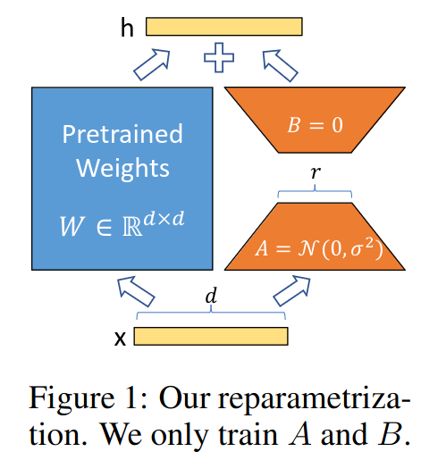
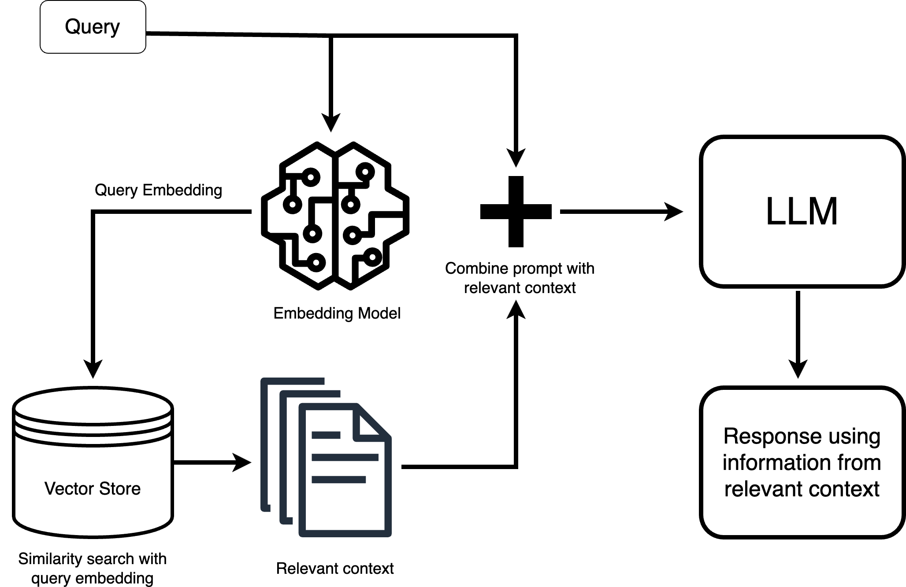

# Miscellaneous topics

### Contents

1.  [Datasets](#datasets)
2.  [Evaluation methods](#evaluation-methods)
3.  [Voice to text](#voice-to-text)
4.  [Multimodal models](#multimodal-models)
5.  [LoRA](#lora)
6.  [RAG](#rag)
7.  [More](#more)

## Datasets

-   Liu, Y. et al. (2024). [Datasets for large language models: A comprehensive survey](https://arxiv.org/abs/2402.18041).
-   Weber, M. et al. (2024). [RedPajama: An open dataset for training large language models](https://arxiv.org/abs/2411.12372).

## Evaluation methods

-   Hendrycks, D. et al. (2020). [Measuring Massive Multitask Language Understanding](https://arxiv.org/abs/2009.03300). (MMLU)
-   Yue, X. et al. (2023).  [MMMU: A Massive Multi-discipline Multimodal Understanding and reasoning benchmark for expert AGI](https://arxiv.org/abs/2311.16502).
-   Kim, J. et al. (2024). [Evalverse: Unified and accessible library for large language model evaluation](https://arxiv.org/abs/2404.00943).
-   Biderman, S. (2024). [Lessons from the trenches on reproducible evaluation of language models](https://arxiv.org/abs/2405.14782).
-   [Stanford's HELM Leaderboards](https://crfm.stanford.edu/helm/)
    -   Liang, P. et al. (2022). [Holistic Evaluation of Language Models (HELM)](https://arxiv.org/abs/2211.09110)
    -   Lee, T. et al. (2023). [Holistic Evaluation of Text-To-Image Models (HEIM)](https://arxiv.org/abs/2311.04287)
    -   [github.com/stanford-crfm/helm](https://github.com/stanford-crfm/helm)
-   [EleutherAI/lm-evaluation-harness](https://github.com/EleutherAI/lm-evaluation-harness)
    -   Srivastava, A. (2022). [Beyond the Imitation Game: Quantifying and extrapolating the capabilities of language models](https://arxiv.org/abs/2206.04615).
    -   Suzgun, M. (2022). [Challenging BIG-Bench Tasks and Whether Chain-of-Thought Can Solve Them](https://arxiv.org/abs/2210.09261).
    -   Wang, Y. (2024). [MMLU-Pro: A More Robust and Challenging Multi-Task Language Understanding Benchmark](https://arxiv.org/abs/2406.01574).

## Speech to text

-   Whisper model (OpenAI)
-   Transformer based, encoder-decoder

).](img/whisper.png)

## Multimodal models

.](img/gemini-multimodal.png)

## LoRA

-    LoRA: Low-rank adaptation

-   Hu, E.J. et al (2021). [LoRA: Low-rank adaptation of large language models](https://arxiv.org/abs/2106.09685)
-   Dettmers, T., Pagnoni, A., Holtzman, A., & Zettlemoyer, L. (2023). [QLoRA: Efficient finetuning of quantized LLMs](https://arxiv.org/abs/2305.14314).
-   Zhao, J. et al (2024). [GaLore: Memory-efficient LLM training by gradient low-rank projection](https://arxiv.org/abs/2403.03507).
-   Huh, M. (2024). [Training neural networks from scratch with parallel low-rank adapters](https://arxiv.org/abs/2402.16828).

## RAG

-   Retrieval-Augmented Generation (RAG)
-   Lewis, P. et al. (2020). [Retrieval-Augmented Generation for knowledge-intensive NLP tasks](https://proceedings.neurips.cc/paper/2020/file/6b493230205f780e1bc26945df7481e5-Paper.pdf).
-   Requires a large context size to hold the retrieved documents
-   Jin, B., Yoon, J., Han, J., & Arik, S.O. (2024). [Long-context LLMs meet RAG: Overcoming challenges for long inputs in RAG](https://arxiv.org/abs/2410.05983).

## More

-   [Insights from Kaggle Grandmasters and Experts on Competitive AI and LLM Frontiers](https://www.youtube.com/watch?v=k2EcIX0HgzA). *GTC, 2024*.

--------

-   Up next: TODO
-   Previous: [Parallelism and hardware](parallelism-and-hw.md)

