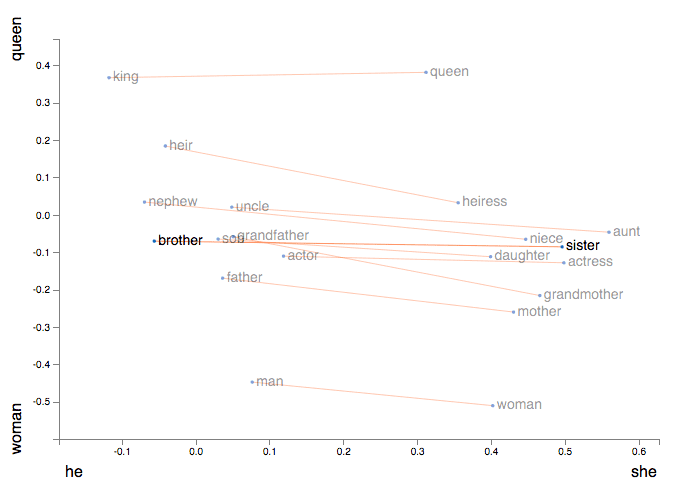
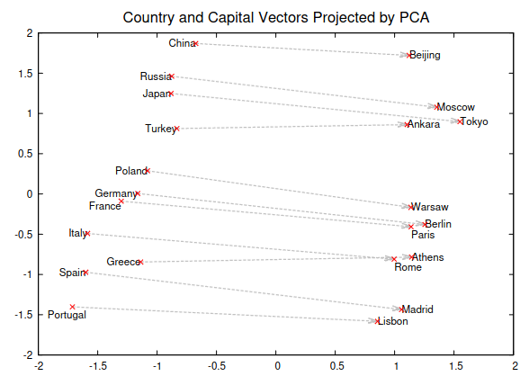

# Natural language

TODO

Outline:

1.  [Tokenization](#tokenization)
2.  [Input tensor shape](#input-tensor-shape)
3.  [Embedding (word2vec)](#embedding-word2vec)
4.  [seq2seq](#seq2seq)
5.  [Transformer](#transformer)
6.  [BERT](#bert)
7.  [T5](#t5)
8.  [Conclusion](#conclusion)


## Tokenization

Tokenization is the process of taking a sequence of text
and breaking it into units called *tokens*.
You can think of tokens as being words,
but in general they can be parts of words.

Tokens are generally then converted to "token IDs" that
are integer encodings of the tokens.

Example:

```
text = "Hello, world! This is tokenization."
tokens = ["<start>", "Hello", ",", " ", "world", "!", " ", "This", " ", "is", " ", "token", "iza", "tion", ".", "<end>"]
token_ids = [1, 123, 22, 2223, 10, 335, 556, 10, ... ]
```

-   Tokenization is basically a map from word parts to integers.
-   It is important to note that tokenization is dependent on a *vocabulary* used to make the map.
-   So note that a certain tokenization may not support any language.
    The language needs to be in vocabulary.
-   A typical vocabulary size is something like $\sim$ 50,000.

See also:

-   Tutorial video by Andrej Karpathy: [Let's build the GPT Tokenizer](https://www.youtube.com/watch?v=zduSFxRajkE)


## Input tensor shape

Often tokenization is done in the `DataLoader`, which also forms batches of the data in the form of a tensor for the model.
To square up the input tensor size, often needs to *pad* the sequences to a common *max sequence length* (MSL).

Often the pad token ID is `0`, so a padded sequence would look like

```
token_ids = [1, 123, 22, 2223, 10, 335, 556, 10, ..., 0, 0, 0]
```

The input tensor shape for language models is often:

```
[batch_size][max_seq_length]            e.g. [8][256]
```


## Embedding (word2vec)

After tokenization, the next step in a language model is to *embed* the tokens,
which is a map from the token IDs to a vector in some large space,
with dimension called the `embedding_size`.

The tensor shape of the output of the embedding is

```
[batch_size][max_seq_length][embedding_size]       e.g. [8][256][1280]
```

After the embedding parameters are trained end-to-end with a model,
remarkably, you can give some *semantic interpretations* to some basis
vectors in the embedding space.  Famously, for example

$$ \vec{E}(\mathrm{king}) - \vec{E}(\mathrm{man}) + \vec{E}(\mathrm{woman}) \approx \vec{E}(\mathrm{queen}) $$



Another example where a dimension in the embedding correlates with the capital of a country:



See also:

-   Mikolov, T., Chen, K., Corrado, G., & Dean, J. (2013). [Efficient estimation of word representations in vector space](https://arxiv.org/abs/1301.3781).
-   Mikolov, T. et al. (2013). [Distributed representations of words and phrases and their compositionality](https://arxiv.org/abs/1310.4546).
-   Mikolov, T., Yih, W. T., & Zweig, G. (2013). [Linguistic regularities in continuous space word representations](https://www.aclweb.org/anthology/N13-1090.pdf).
-   Olah, C. (2014). [Deep learning, NLP, and representations](https://colah.github.io/posts/2014-07-NLP-RNNs-Representations/).


## seq2seq

-   RNNs and LSTMs
-   seq2seq: Watershed moment in NLP with deep learning
    -   Sutskever, I., Vinyals, O., & Le, Q. V. (2014). [Sequence to sequence learning with neural networks](https://arxiv.org/abs/1409.3215).
    -   First very successful encoder-decoder based model
-   Bahdanau "attention"
    -   Bahdanau, D., Cho, K., & Bengio, Y. (2015). [Neural machine translation by jointly learning to align and translate](https://arxiv.org/abs/1409.0473).
-   Google Neural Machine Translation (GNMT)
    -   Wu, Y. et al. (2016). [Google’s neural machine translation system: Bridging the gap between human and machine translation](https://arxiv.org/abs/1409.0473).


## Transformer

TODO

).](img/transformer.png)

-   Vaswani, A. et al. (2017). [Attention is all you need](https://arxiv.org/abs/1706.03762).
-   Phuong, M. & Hutter, M. (2022). [Formal algorithms for transformers](https://arxiv.org/abs/2207.09238).


## BERT

TODO

-   Devlin, J., Chang, M., Lee, K., & Toutanova, K. (2018). [BERT: Pre-training of deep bidirectional transformers for language understanding](https://arxiv.org/abs/1810.04805).


## T5

TODO

).](img/t5-description-of-transformer-types.png)

-   Raffel, C. et al. (2019). [Exploring the limits of transfer learning with a unified text-to-text transformer](https://arxiv.org/abs/1910.10683).


## Conclusion

).](img/evolutionary-tree-of-LLMs.png)

-   Yang, J. et al. (2023). [Harnessing the power of LLMs in practice: A survey on ChatGPT and beyond](https://arxiv.org/abs/2304.13712).
-   Raschka, S. (2023). [Understanding large language models](https://magazine.sebastianraschka.com/p/understanding-large-language-models).

--------

-   Up next: [Parallelism and hardware](parallelism-and-hw.md)
-   Previous: [Computer vision](computer-vision.md)

