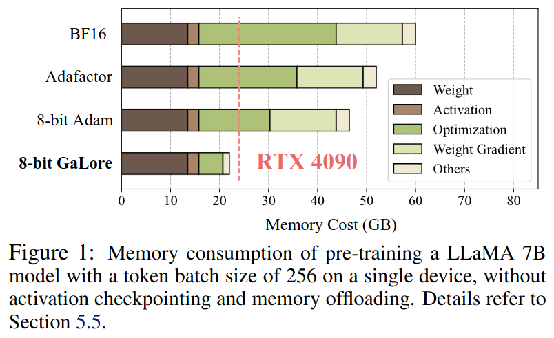
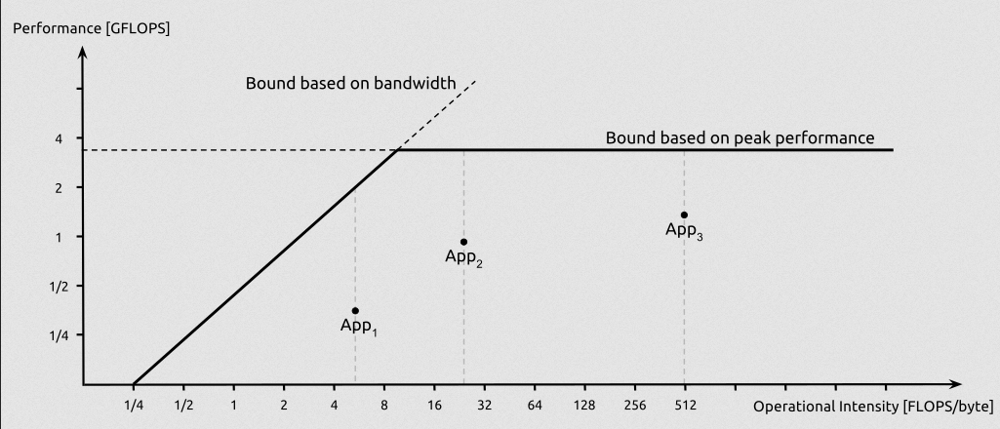

# Parallelism and hardware

### Contents

1.  [Introduction](#introduction)
2.  [Performance and bandwidth](#performance-and-bandwidth)
3.  [Model parallelism](#model-parallelism)
4.  [Computational complexity of transformers](#computational-complexity-of-transformers)
5.  [Efficient transformers: Inference optimizations](#efficient-transformers-inference-optimizations)
5.  [Efficient transformers: Architecture modifications](#efficient-transformers-architecture-modifications)
6.  [Accelerators](#accelerators)
7.  [Conclusion](#conclusion)

## Introduction

-   Single Instruction/Multiple Data (SIMD) and GPUs
-   [FLOPs vs FMACs](https://medium.com/@pashashaik/a-guide-to-hand-calculating-flops-and-macs-fa5221ce5ccc)
-   [Data parallel vs model parallel vs tensor parallel](https://colossalai.org/docs/concepts/paradigms_of_parallelism/)
-   SRAM vs DRAM

-   Hooker, S. (2020). [The hardware lottery](https://arxiv.org/abs/2009.06489).
-   Sevilla, J. et al. (2022). [Compute trends across three eras of machine learning](https://arxiv.org/abs/2202.05924).
-   He, H. (2022). [Making deep learning go brrrr from first principles](https://horace.io/brrr_intro.html).
-   Geiping, J. & Goldstein, T. (2022). [Cramming: Training a language model on a single GPU in one day](https://arxiv.org/abs/2212.14034).
-   Spector, B. (2024). [GPUs go brrr](https://hazyresearch.stanford.edu/blog/2024-05-12-tk).

## Performance and bandwidth

Roofline plots:

-   Williams, S., Waterman, A., & Patterson, D. (2009). [Roofline: an insightful visual performance model for multicore architectures](https://dl.acm.org/doi/pdf/10.1145/1498765.1498785).
-   Chng, P. (2024). [The naive roofline model in performance modeling](https://peterchng.com/blog/2024/08/29/the-naive-roofline-model-in-performance-modeling/).

## Model parallelism

-   [Model parallelism](https://huggingface.co/docs/transformers/v4.17.0/en/parallelism) - HuggingFace

## Computational complexity of transformers

-   Chen, C. (2022). [Transformer inference arithmetic](https://kipp.ly/transformer-inference-arithmetic/).
-   Bahdanau, D. (2022). [The FLOPs calculus of language model training](https://medium.com/@dzmitrybahdanau/the-flops-calculus-of-language-model-training-3b19c1f025e4).
-   Sanger, A. (2023). [Inference characteristics of Llama-2](https://cursor.sh/blog/llama-inference). 
-   Shenoy, V. & Kiely, P. (2023). [A guide to LLM inference and performance](https://www.baseten.co/blog/llm-transformer-inference-guide/).
-   Anthony, Q., Biderman, S., & Schoelkopf, H. (2023). [Transformer math 101](https://blog.eleuther.ai/transformer-math/).

## Efficient transformers: Inference optimizations

-   Dao, T., Fu, D.Y., Ermon, S., Rudra, A., & Ré, C. (2022). [FlashAttention: Fast and memory-efficient exact attention with IO-awareness](https://arxiv.org/abs/2205.14135).
-   Pope, R. et al. (2022). [Efficiently scaling transformer inference](https://arxiv.org/abs/2211.05102). - *KV cache*
-   Dao, T. (2023). [FlashAttention-2: Faster attention with better parallelism and work partitioning](https://arxiv.org/abs/2307.08691).
-   Kim, S. et al. (2023). [Full stack optimization of transformer inference: A survey](https://arxiv.org/abs/2302.14017).
-   PyTorch. (2023). [Accelerating generative AI with PyTorch II: GPT, Fast](https://pytorch.org/blog/accelerating-generative-ai-2/).
-   Nvidia. (2023). [Mastering LLM techniques: Inference optimization](https://developer.nvidia.com/blog/mastering-llm-techniques-inference-optimization).
-   Weng, L. (2023). [Large transformer model inference optimization](https://lilianweng.github.io/posts/2023-01-10-inference-optimization/).
-   Kwon, W. et al. (2023). [Efficient memory management for large language model serving with PagedAttention](https://arxiv.org/abs/2309.06180).
-   Zhang, L. (2023). [Dissecting the runtime performance of the training, fine-tuning, and inference of large language models](https://arxiv.org/abs/2311.03687).
-   Fu, Y. (2023). [Towards 100x speedup: Full stack transformer inference optimization](https://yaofu.notion.site/Towards-100x-Speedup-Full-Stack-Transformer-Inference-Optimization-43124c3688e14cffaf2f1d6cbdf26c6c#5e3b9489c0204f8c8d70d014a9e88b28).
-   Fu, Y. (2024). [Challenges in deploying long-context transformers: A theoretical peak performance analysis](https://arxiv.org/abs/2405.08944).
-   Fu, Y. et al. (2024). [Data engineering for scaling language models to 128K context](https://arxiv.org/abs/2402.10171).
-   Kwon, W. et al. (2023). [Efficient memory management for large language model serving with PagedAttention](https://arxiv.org/abs/2309.06180). ([vLLM](https://github.com/vllm-project/vllm))
-   Chen, L. (2023). [Dissecting batching effects in GPT inference](https://le.qun.ch/en/blog/2023/05/13/transformer-batching/).
-   Nvidia. (2023). [Mastering LLM techniques: Inference optimization](https://developer.nvidia.com/blog/mastering-llm-techniques-inference-optimization).
-   Chng, P. (2024). [What is the transformer KV cache?](https://peterchng.com/blog/2024/06/11/what-is-the-transformer-kv-cache/)
-   Shah, J. et al. (2024). [FlashAttention-3: Fast and accurate attention with asynchrony and low-precision](https://arxiv.org/abs/2407.08608).
-   Shi, L. et al. (2024). [Keep the cost down: A review on methods to optimize LLM' s KV-cache consumption](https://arxiv.org/abs/2407.18003).

## Efficient transformers: Architecture modifications

-   Shazeer, N. (2019). [Fast transformer decoding: One write-head is all you need](https://arxiv.org/abs/1911.02150).  - MQA
-   Tay, Y., Dehghani, M., Bahri, D., & Metzler, D. (2022). [Efficient transformers: A survey](https://arxiv.org/abs/2009.06732).
-   Ainslie, J. (2023). [GQA: Training generalized multi-query transformer models from multi-head checkpoints](https://arxiv.org/abs/2305.13245). - GQA

## Accelerators

### Nvidia

-   Volkov, V. (2016). [*Understanding Latency Hiding on GPUs*](https://www2.eecs.berkeley.edu/Pubs/TechRpts/2016/EECS-2016-143.pdf). (PhD thesis)
-   Dettmers, T. (2023). [Which GPU(s) to Get for Deep Learning: My Experience and Advice for Using GPUs in Deep Learning](https://timdettmers.com/2023/01/30/which-gpu-for-deep-learning/).
-   Nvidia. (2023). [GPU performance background user's guide](https://docs.nvidia.com/deeplearning/performance/dl-performance-gpu-background/index.html).

### Cerebras

-   Cerebras. (2020). [Fast stencil-code computation on a wafer-scale processor](https://arxiv.org/abs/2010.03660).
-   Cerebras. (2021). [The path to successful wafer-scale integration: The cerebras story](https://8968533.fs1.hubspotusercontent-na1.net/hubfs/8968533/IEEE%20Micro%202021-11%20Path%20to%20Wafer-Scale%20Integration.pdf).
-   Cerebras. (2022). [Wafer-scale fast fourier transforms](https://arxiv.org/abs/2209.15040).
-   Cerebras. (2023). [Cerebras architecture deep dive: First look inside the hardware/software co-design for deep learning](https://8968533.fs1.hubspotusercontent-na1.net/hubfs/8968533/IEEE%20Micro%202023-03%20Hot%20Chips%2034%20Cerebras%20Architecture%20Deep%20Dive.pdf).
-   Cerebras. (2023). [Training giant neural networks using weight streaming on cerebras wafer-scale systems](https://8968533.fs1.hubspotusercontent-na1.net/hubfs/8968533/Virtual%20Booth%20Docs/CS%20Weight%20Streaming%20White%20Paper.pdf).
-   Cerebras. (2024). [S-1 filing with the SEC](https://www.sec.gov/Archives/edgar/data/2021728/000162828024041596/cerebras-sx1.htm). 2024/09/30.

### Groq

-   Groq. (2020). [Think Fast: A Tensor Streaming Processor (TSP) for accelerating deep learning workloads](https://groq.com/wp-content/uploads/2020/06/ISCA-TSP.pdf).
-   Groq. (2022). [A software-defined tensor streaming multiprocessor for large-scale machine learning](https://wow.groq.com/wp-content/uploads/2023/05/GroqISCAPaper2022_ASoftwareDefinedTensorStreamingMultiprocessorForLargeScaleMachineLearning-1.pdf).
-   Groq. (2024). [Optimized simulation methodology of warpage and localized stress hotspot prediction for assembly risk assessment](https://groq.com/wp-content/uploads/2024/06/Zhi_ECTC_Optimized-Simulation-Methodology-of-Warpage-and-Localized-Stress-Hotspot-Prediction-for-Assembly-Risk-Assessment_Mar1.pdf).

### SambaNova

-   SambaNova. (2024). [SambaNova SN40L: Scaling the AI memory wall with dataflow and composition of experts](https://arxiv.org/abs/2405.07518).

### Tenstorrent

-   Th&uuml;ning, M. (2024). [Attention in SRAM on Tenstorrent Grayskull](https://arxiv.org/abs/2407.13885).

Others:

-   d-Matrix
-   Furiosa
-   Graphcore
-   Lightmatter
-   MatX
-   Taalas

## Conclusion

TODO

--------

-   Up next: [Misc](misc.md)
-   Previous: [Natural language](natural-language.md)

