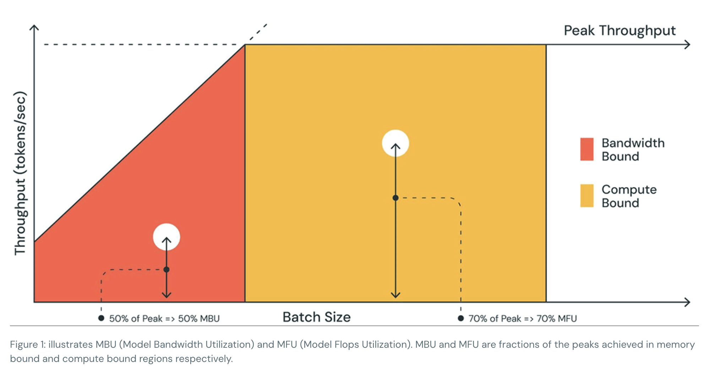
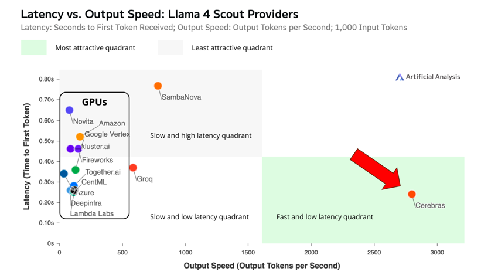

# Parallelism and hardware

### Contents

1.  [Introduction](#introduction)
2.  [Performance and bandwidth](#performance-and-bandwidth)
3.  [Model parallelism](#model-parallelism)
4.  [Kernel programming](#kernel-programming)
5.  [Accelerators - Big Tech](#accelerators---big-tech)
6.  [Accelerators - Startups](#accelerators---startups)
7.  [Benchmarking](#benchmarking)
8.  [Scaling](#scaling)
9.  [Conclusion](#conclusion)

## Introduction

-   Single Instruction/Multiple Data (SIMD) and GPUs
-   [FLOPs vs FMACs](https://medium.com/@pashashaik/a-guide-to-hand-calculating-flops-and-macs-fa5221ce5ccc)
-   [Data parallel vs model parallel vs tensor parallel](https://colossalai.org/docs/concepts/paradigms_of_parallelism/)
-   SRAM vs DRAM
-   [Amdahl's law](https://en.wikipedia.org/wiki/Amdahl%27s_law)

-   Kung, H.T. (1982). [Why systolic architectures](https://www.eecs.harvard.edu/~htk/publication/1982-kung-why-systolic-architecture.pdf).
-   Hooker, S. (2020). [The hardware lottery](https://arxiv.org/abs/2009.06489).
-   Sevilla, J. et al. (2022). [Compute trends across three eras of machine learning](https://arxiv.org/abs/2202.05924).
-   He, H. (2022). [Making deep learning go brrrr from first principles](https://horace.io/brrr_intro.html).
-   Geiping, J. & Goldstein, T. (2022). [Cramming: Training a language model on a single GPU in one day](https://arxiv.org/abs/2212.14034).
-   Spector, B. (2024). [GPUs go brrr](https://hazyresearch.stanford.edu/blog/2024-05-12-tk).

## Performance and bandwidth

Roofline plots:

-   Williams, S., Waterman, A., & Patterson, D. (2009). [Roofline: an insightful visual performance model for multicore architectures](https://dl.acm.org/doi/pdf/10.1145/1498765.1498785).
-   Mohan, A. (2018). [Understanding roofline charts](https://www.telesens.co/2018/07/26/understanding-roofline-charts/).
-   Chen, L. (2023). [Dissecting batching effects in GPT inference](https://le.qun.ch/en/blog/2023/05/13/transformer-batching/).
-   Chng, P. (2024). [The naive roofline model in performance modeling](https://peterchng.com/blog/2024/08/29/the-naive-roofline-model-in-performance-modeling/).
-   Kao, S.C. et al. (2022). [FRAME: Fast Roofline Analytical Modeling and Estimation](https://github.com/maestro-project/frame).
-   Databricks. (2023). [LLM inference performance engineering: best practices](https://www.databricks.com/blog/llm-inference-performance-engineering-best-practices).
-   Yuan, Z. et al. (2024). [LLM inference unveiled: Survey and roofline model insights](https://arxiv.org/abs/2402.16363).
    -   <https://github.com/hahnyuan/LLM-Viewer>
    -   <http://llm-viewer.com>
-   Yun, S. et al. (2025). [The new LLM bottleneck: A systems perspective on latent attention and mixture-of-experts](https://arxiv.org/abs/2507.15465).

## Model parallelism

-   [Model parallelism](https://huggingface.co/docs/transformers/v4.17.0/en/parallelism) - HuggingFace
-   Pipeline parallelism
-   Tensor parallelism

## Kernel programming

### Nvidia: CUDA

-   Nvidia. (2024). [CUDA C++ Programming Guide](https://docs.nvidia.com/cuda/cuda-c-programming-guide/).
-   Harris, M. (2017). Nvidia blog: [An Even Easier Introduction to CUDA](https://developer.nvidia.com/blog/even-easier-introduction-cuda/).
-   Boehm, S. (2022). [How to Optimize a CUDA Matmul Kernel for cuBLAS-like Performance: a Worklog](https://siboehm.com/articles/22/CUDA-MMM).
-   [github.com/ANSANJAY/KernelDev101](https://github.com/ANSANJAY/KernelDev101)
-   [github.com/cupy/cupy](https://github.com/cupy/cupy)
-   [github.com/NVIDIA/cuda-python](https://github.com/NVIDIA/cuda-python)
-   [github.com/NVIDIA/nvmath-python](https://github.com/NVIDIA/nvmath-python)

### AMD: ROCm

-   [ROCm Documentation](https://rocm.docs.amd.com/en/latest/)

## Accelerators - Big Tech

### Nvidia

Products: 

-    ..., V100, A100, H100, B100, GB200-based systems (DGX)
-    GB200 NVL72: 1 rack, 1 exaFLOP, 120 kW

Acquisitions:

-   [Nvidia acquires open-source workload management provider SchedMD](https://blogs.nvidia.com/blog/nvidia-acquires-schedmd/). 2025/12/15.
-   [Nvidia buying AI chip startup Groq's assets for about $20 billion in its largest deal on record](https://www.cnbc.com/2025/12/24/nvidia-buying-ai-chip-startup-groq-for-about-20-billion-biggest-deal.html). 2025/12/24.
    -   [Groq and Nvidia enter non-exclusive inference technology licensing agreement to accelerate AI inference at global scale](https://groq.com/newsroom/groq-and-nvidia-enter-non-exclusive-inference-technology-licensing-agreement-to-accelerate-ai-inference-at-global-scale). 2025/12/24.

Whitepapers:

-   Nvidia. (2023). [GPU performance background user's guide](https://docs.nvidia.com/deeplearning/performance/dl-performance-gpu-background/index.html).

Media:

-   Dettmers, T. (2023). [Which GPU(s) to Get for Deep Learning: My Experience and Advice for Using GPUs in Deep Learning](https://timdettmers.com/2023/01/30/which-gpu-for-deep-learning/).

Research:

-   Volkov, V. (2016). [*Understanding Latency Hiding on GPUs*](https://www2.eecs.berkeley.edu/Pubs/TechRpts/2016/EECS-2016-143.pdf). (PhD thesis)

### Amazon

Products: TODO

Whitepapers:

-    [AWS Inferentia](https://aws.amazon.com/ai/machine-learning/inferentia/)

Media: TODO

Research:

-    Zheng, H. et al. (2020). [Optimizing memory-access patterns for deep learning accelerators](https://arxiv.org/pdf/2002.12798).

### AMD

Products:

-   MI300X
-   [tinybox red](https://tinygrad.org/#tinybox) uses 6x Radeon RX 7900XTX (2024)

Acquisitions:

-   Untether AI (2025)

TODO: Whitepapers, Media, Research

### Apple

Products: M4

TODO: Whitepapers, Media, Research

### Google

Products: 7th-gen TPU, Ironwood (not for sale)

Whitepapers:

-    Google Cloud. (2025). [Google Cloud Next 25](https://blog.google/products/google-cloud/next-2025/).

### Intel

Products: Gaudi 2

Whitepapers:

-   [Gaudi 2](https://habana.ai/products/gaudi2/)

Acquisitions:

-    Nervana Systems (2016)
-    Habana Labs (2019)

Media:

-   Lam, C. & Cozma, G. (2023). [Intel’s Ponte Vecchio: Chiplets gone crazy](https://chipsandcheese.com/p/intels-ponte-vecchio-chiplets-gone-crazy).
-   Hotz, G. (2025). [The tragic case of Intel AI](https://geohot.github.io/blog/jekyll/update/2025/03/24/tragic-intel.html). 2025/03/24.
-   Intel. (2025). [Intel and Trump Administration reach historic agreement to accelerate American technology and manufacturing leadership](https://www.intc.com/news-events/press-releases/detail/1748/intel-and-trump-administration-reach-historic-agreement-to). 2025/08/22.
-   Intel. (2025). [Intel and NVIDIA to jointly develop AI infrastructure and personal computing products](https://newsroom.intel.com/artificial-intelligence/intel-and-nvidia-to-jointly-develop-ai-infrastructure-and-personal-computing-products). 2025/09/18.

Research:

-   TODO

### Meta

Products: MTIA v2

Acquisitions:

-   [Meta plans to buy chip startup Rivos to boost semiconductor efforts](https://www.reuters.com/business/meta-buy-chip-startup-rivos-ai-effort-source-says-2025-09-30/). 2025-09-30.
    -   [Meta is acquiring chip startup Rivos for a reported ~$2B](https://semiwiki.com/forum/threads/meta-is-acquiring-chip-startup-rivos-for-a-reported-2b-to-turbocharge-its-in-house-ai-chips-mtia-and-cut-its-heavy-reliance-on-nvidia.23756/). 2025/10/08.
-   [Meta buys Manus for $2B](https://techcrunch.com/2025/12/29/meta-just-bought-manus-an-ai-startup-everyone-has-been-talking-about/). 2025/12/29.

Whitepapers:

-   Meta. (2024). [Meta Training and Inference Accelerator (MTIA)](https://ai.meta.com/blog/next-generation-meta-training-inference-accelerator-AI-MTIA/).
-   Meta. (2025). [Meta’s second generation AI chip: Model-chip co-design and productionization experiences](https://aisystemcodesign.github.io/papers/MTIA-ISCA25.pdf).

TODO: Media, Research

## Accelerators - Startups

### Axelera

-   Fabrizio Del Maffeo (CEO)
-   Eindhoven, Netherlands

Products: Metis, Europa

### Blaize

-   Dinakar Munagala (CEO)
-   First AI chip startup to go public, on 2025/01/14 via SPAC, NASDAQ:BZAI

Products: Xplorer and Pathfinder

Whitepapers:

-    [Blaize AI edge computing products](https://www.blaize.com/products/ai-edge-computing-platforms/)

Media:

-   Blaize. (2025). [S-1 filing with the SEC](https://ir.blaize.com/sec-filings/sec-filing/s-1/0001193125-25-008689). 2025/01/21.

Research: TODO

### Cerebras

-   Andrew Feldman (CEO)
-   Wafer-scale; All-SRAM approach

Products: CS-3

Whitepapers:

-   Cerebras. (2021). [The path to successful wafer-scale integration: The Cerebras story](https://8968533.fs1.hubspotusercontent-na1.net/hubfs/8968533/IEEE%20Micro%202021-11%20Path%20to%20Wafer-Scale%20Integration.pdf).
-   Cerebras. (2021). [Cerebras Systems: Achieving industry best AI performance through a systems approach](https://8968533.fs1.hubspotusercontent-na1.net/hubfs/8968533/Whitepapers/Cerebras-CS-2-Whitepaper.pdf). (CS-2 Whitepaper)
-   Cerebras. (2023). [Cerebras architecture deep dive: First look inside the hardware/software co-design for deep learning](https://8968533.fs1.hubspotusercontent-na1.net/hubfs/8968533/IEEE%20Micro%202023-03%20Hot%20Chips%2034%20Cerebras%20Architecture%20Deep%20Dive.pdf).
-   Cerebras. (2023). [Training giant neural networks using weight streaming on Cerebras wafer-scale systems](https://8968533.fs1.hubspotusercontent-na1.net/hubfs/8968533/Virtual%20Booth%20Docs/CS%20Weight%20Streaming%20White%20Paper.pdf).

Media:

-   Ray, T. (2024). [AI startup Cerebras debuts 'world's fastest inference' service - with a twist](https://www.zdnet.com/article/ai-startup-cerebras-debuts-worlds-fastest-inference-with-a-twist/). 2024/8/27.
-   Cerebras. (2024). [S-1 filing with the SEC](https://www.sec.gov/Archives/edgar/data/2021728/000162828024041596/cerebras-sx1.htm). 2024/09/30.
-   Turck, M. (2024). [Quick S-1 teardown: Cerebras](https://mattturck.com/cerebras/). 2024/10/1.
-   Wilhelm, A. (2024). [Inside AI chip startup Cerebras's S-1 filing](https://www.cautiousoptimism.news/p/inside-ai-chip-startup-cerebrass). 2024/10/1.
-   Reuters. (2025). [Cerebras IPO further delayed as US national security review drags on](https://www.reuters.com/technology/cerebras-ipo-further-delayed-us-national-security-review-drags-2025-03-25/). 2025/03/25.
-   The Register. (2025). [Nvidia challenger Cerebras says it's leaped Mid-East funding hurdle on way to IPO](https://www.theregister.com/2025/03/31/cerebras_ipo_roadblock/). 2025/03/31.
-   TechInAsia. (2025). [US-based AI chipmaker plans 2025 IPO after UAE deal approved](https://www.techinasia.com/news/usbased-ai-chipmaker-plans-2025-ipo-uae-deal-approved). 2025/05/15.
-   techstartups.com. (2025). [Cerebras seeks $1B in private funding to battle Nvidia, delays IPO over security scrutiny](https://techstartups.com/2025/07/29/cerebras-seeks-1b-in-private-funding-to-battle-nvidia-delays-ipo-over-security-scrutiny/). 2025/07/29.
-   TechCrunch. (2025). [A year after filing to IPO, still-private Cerebras Systems raises $1.1B](https://techcrunch.com/2025/09/30/a-year-after-filing-to-ipo-still-private-cerebras-systems-raises-1-1b/). 2025/09/30. -- Series G
-   Freund, K. (2025). [Cerebras, Groq And SambaNova line up to compete with Nvidia](https://www.forbes.com/sites/karlfreund/2025/10/21/cerebras-groq-and-sambanova-line-up-to-compete-with-nvidia). 2025/10/21.

Research:

-   Cerebras. (2020). [Fast stencil-code computation on a wafer-scale processor](https://arxiv.org/abs/2010.03660).
-   Cerebras. (2022). [Wafer-scale fast fourier transforms](https://arxiv.org/abs/2209.15040).
-   Santos, K. et al. (2024). [Breaking the molecular dynamics timescale barrier using a wafer-scale system](https://arxiv.org/pdf/2405.07898).
-   He, C. et al. (2025). [WaferLLM: A wafer-scale LLM inference system](https://arxiv.org/abs/2502.04563).

### d-Matrix

-   Sid Sheth (CEO)
-   Digital Processing-in-Memory (PIM), AKA in-memory compute

Products: Corsair

Whitepapers:

-   d-Matrix. (2023). [d-Matrix total cost of ownership white paper](https://www.d-matrix.ai/wp-content/uploads/2023/09/d-Matrix-WhitePaper-Approved-w-cover.pdf).
-   d-Matrix. (2024). [d-Matrix Corsair redefines performance and efficiency for AI inference at scale](https://www.d-matrix.ai/wp-content/uploads/2024/11/d-Matrix-WhitePaper-Technical-FINAL.pdf).

Media:

-   Forbes. (2024). [d-Matrix-emerges-from-stealth-with-strong-ai-performance-and-efficiency](https://www.forbes.com/sites/karlfreund/2024/11/19/d-matrix-emerges-from-stealth-with-strong-ai-performance--efficiency/). 2024/11/19.
-   Belateche, Z. (2024). [Most AI chips aren’t cost-effective](https://www.zach.be/p/most-ai-chips-arent-cost-effective). 2024/11/26.
-   techradar. (2024). [Microsoft backed, a tiny hardware startup that just launched its first AI processor that does inference without GPU or expensive HBM memory, and a key Nvidia partner, Micron Technology, is collaborating with it](https://www.techradar.com/pro/microsoft-backed-a-tiny-hardware-startup-that-just-launched-its-first-ai-processor-that-does-inference-without-gpu-or-expensive-hbm-memory-and-a-key-nvidia-partner-is-collaborating-with-it). 2024/12/28.
-   EETimes. (2025). [d-Matrix targets fast LLM inference for 'real world scenarios’](https://www.eetimes.com/d-matrix-targets-fast-llm-inference-for-real-world-scenarios/). 2025/01/13.
-   Sekar, V. (2025). [How d-Matrix's in-memory compute tackles AI inference economics](https://www.viksnewsletter.com/p/d-matrix-in-memory-compute). 2025/12/09.

Research: TODO

### Furiosa

-   June Paik (CEO)

Products:

-   RNGD
-   Gen 1 Vision NPU

Whitepapers:

-   Furiosa. (2024). [TCP: A Tensor Contraction Processor for AI workloads industrial product](https://ieeexplore.ieee.org/document/10609575).

Media:

-   Forbes. (2025). [Meta in talks to buy Korean AI chip startup founded by Samsung engineer](https://www.forbes.com/sites/johnkang/2025/02/11/meta-in-talks-to-buy-korean-ai-chip-startup-founded-by-samsung-engineer/). 2025/02/11.
-   CCN. (2025). [FuriosaAI turns down Meta’s $800M offer following breakthroughs in Llama 3.1 and AI inference](https://www.ccn.com/news/technology/furiosaai-meta-800m-llama31-inference/). 2025/03/24.

Research: TODO

### Groq

-   Jonathan Ross (CEO)
    -   Became Chief Software Architect at Nvidia (Dec 2025)
-   Simon Edwards became new CEO of Groq (Dec 2025)
-   All-SRAM approach

Products:

-   LPU
-   GroqCloud
-   GroqRack

Acquisitions:

-   [Definitive Intelligence](https://groq.com/news/groq-acquires-definitive-intelligence-to-launch-groqcloud) (2024)

Whitepapers:

-   Groq. (2020). [Think Fast: A Tensor Streaming Processor (TSP) for accelerating deep learning workloads](https://groq.com/wp-content/uploads/2020/06/ISCA-TSP.pdf).
-   Groq. (2022). [A software-defined tensor streaming multiprocessor for large-scale machine learning](https://wow.groq.com/wp-content/uploads/2023/05/GroqISCAPaper2022_ASoftwareDefinedTensorStreamingMultiprocessorForLargeScaleMachineLearning-1.pdf).

Media:

-   Linley Group. (2020). [Groq rocks neural networks](https://groq.com/wp-content/uploads/2023/05/GROQ-ROCKS-NEURAL-NETWORKS.pdf).
-   Groq. (2025). [Groq becomes exclusive inference provider for Bell Canada’s sovereign AI network](https://groq.com/news_press/groq-becomes-exclusive-inference-provider-for-bell-canadas-sovereign-ai-network/). 2025/05/28.
-   Groq. (2025). [Groq raises $750 million as inference demand surges](https://groq.com/news/groq-raises-750-million-as-inference-demand-surges). 2025/09/17.

Research:

-   Groq. (2024). [Optimized simulation methodology of warpage and localized stress hotspot prediction for assembly risk assessment](https://groq.com/wp-content/uploads/2024/06/Zhi_ECTC_Optimized-Simulation-Methodology-of-Warpage-and-Localized-Stress-Hotspot-Prediction-for-Assembly-Risk-Assessment_Mar1.pdf).

### Rebellions

-   Sunghyun Park (CEO)

Products: ATOM-Max

Whitepapers:

-   Rebellions. (2024). [ATOM Architecture: Finding the Sweet Spot for GenAI](https://rebellions.ai/wp-content/uploads/2024/07/ATOMgenAI_white-paper.pdf).

TODO: Media, Research

### SambaNova

-   Rodrigo Liang (CEO)

Products:

-   SN40L-based systems
-   SambaNova Suite
-   SambaNova DataScale

Whitepapers:

-   SambaNova. (2024). [SambaNova SN40L: Scaling the AI memory wall with dataflow and composition of experts](https://arxiv.org/abs/2405.07518).
-   SambaNova. (2024). [Why SambaNova's SN40L chip is the best for inference](https://sambanova.ai/blog/sn40l-chip-best-inference-solution).

TODO: Media, Research

### Tenstorrent

-   Jim Keller (CEO)

Products:

-   Wormhole-based systems (n150, n300, Galaxy)
-   Blackhole-based systems (p150, p300, Galaxy)

Acquisitions:

-   [Blue Cheetah Analog Design](https://www.prnewswire.com/news-releases/tenstorrent-acquires-blue-cheetah-analog-design-302495323.html) (2025)

Whitepapers:

-   Tenstorrent. (2021). [Compute substrate for software 2.0](https://ieeexplore.ieee.org/stamp/stamp.jsp?arnumber=9373921).
-   Tenstorrent. (2024). [One-pager: Tensix Processor PCIe Cards](https://cdn.sanity.io/files/jpb4ed5r/production/eefe2b42c1423b693c3a8eaf66c0015157e930a1.pdf).
-   Tenstorrent. (2024). [One-pager: Wormhole Tensix Processor](https://cdn.sanity.io/files/jpb4ed5r/production/7c465635048500a3399800ab432f2e32d89d73a2.pdf).
-   Glagovich, C. (2024). [FlashAttention on Tenstorrent’s Wormhole architecture](https://github.com/tenstorrent/tt-metal/blob/main/tech_reports/FlashAttention/FlashAttention.md).
-   Tenstorrent. (2025). [One-pager: Tenstorrent Galaxy](https://cdn.sanity.io/files/jpb4ed5r/production/b076324de309c1290fbbc033ea7253e54d452f47.pdf).
-   Tenstorrent. (2025). [An open future](https://openfuture.tenstorrent.com/).
-   Tenstorrent. (2025). [Tenstorrent announces Open Chiplet Atlas Ecosystem](https://tenstorrent.com/vision/tenstorrent-announces-open-chiplet-atlas-ecosystem).
-   OCA. (2025). [Open Chiplet Architecture](https://cdn.sanity.io/files/jpb4ed5r/production/bf1d903cec88d24280ede976e5f0e173ac31e95d.pdf).
-   Moreh. (2025). [Distributed inference on heterogeneous accelerators including GPUs, Rubin CPX, and AI accelerators](https://moreh.io/blog/distributed-inference-on-heterogeneous-accelerators-including-gpus-rubin-cpx-and-ai-accelerators-250923/).
-   Moreh. (2025). [Moreh-Tenstorrent AI data center solution system architecture](https://moreh.io/technical-report/moreh-tenstorrent-ai-data-center-solution-system-architecture-251118/).

Media:

-   AnandTech. (2024). [Tenstorrent launches Wormhole AI processors: 466 FP8 TFLOPS at 300W](https://www.anandtech.com/show/21482/tenstorrent-launches-wormhole-ai-processors-466-fp8-tflops-at-300w). 2024/07/19.
-   The Register. (2024). [Tenstorrent's Blackhole chips boast 768 RISC-V cores and almost as many FLOPS](https://www.theregister.com/2024/08/27/tenstorrent_ai_blackhole/). 2024/08/27.
-   corsix.org. (2024). [Tenstorrent Wormhole Series Part 1: Physicalities](https://www.corsix.org/content/tt-wh-part1). 2024/09/06.
-   PR Newswire. (2024). [Tenstorrent closes $693M+ of Series D funding led by Samsung Securities and AFW Partners](https://www.prnewswire.com/news-releases/tenstorrent-closes-693m-of-series-d-funding-led-by-samsung-securities-and-afw-partners-302319584.html). 2024/12/02.
-   Chang, M. (2025). [Memory on Tenstorrent](https://clehaxze.tw/gemlog/2025/03-17-memory-on-tenstorrent.gmi). 2025-03-17.
-   Chang, M. (2025). [Programming Tenstorrent processors](https://clehaxze.tw/gemlog/2025/04-21-programming-tensotrrent-processors.gmi). 2025-04-21.
-   Turtle's AI. (2025). [Tenstorrent launches Blackhole™ line: Scalable AI solutions with RISC-V cores and developer support](https://www.turtlesai.com/en/pages-2635/tenstorrent-launches-blackhole-line-scalable-ai). 2025/04/04.
-   ElioVP. (2025). [MI300X vs H200 vs RX 7900 XTX vs Tenstorrent n300s with vLLM](https://eliovp.com/mi300x-vs-h200-vs-rx-7900-xtx-vs-tenstorrent-n300s-with-vllm/). 2025/05/09.
-   Ward-Foxton, S. (2025). [Jim Keller: Whatever Nvidia does, we'll do the opposite](https://www.eetimes.com/jim-keller-whatever-nvidia-does-well-do-the-opposite/). 2025/06/05.
-   Ventureburn. (2025). [Tenstorrent eyes $800M funding at $3.2B valuation, led by Fidelity](https://ventureburn.com/tenstorrent-ai-funding-800m/). 2025/11/19.
-   The Register. (2025). [Tenstorrent QuietBox tested: A high-performance RISC-V AI workstation trapped in a software blackhole](https://www.theregister.com/2025/11/27/tenstorrent_quietbox_review/). 2025/11/27.
-   Ward-Foxton, S. (2025). [Layoffs at Tenstorrent as startup pivots towards developer sales](https://www.eetimes.com/layoffs-at-tenstorrent-as-startup-pivots-towards-developer-sales/). 2025/12/09.

Research:

-   Th&uuml;ning, M. (2024). [Attention in SRAM on Tenstorrent Grayskull](https://arxiv.org/abs/2407.13885).
-   Brown, N. & Barton, R. (2024). [Accelerating stencils on the Tenstorrent Grayskull RISC-V accelerator](https://arxiv.org/abs/2409.18835).
-   Cavagna, H.P., Cesarini, D., & Bartolini, A. (2025). [Assessing Tenstorrent’s RISC-V MatMul acceleration capabilities](https://www.arxiv.org/abs/2505.06085).
-   Cai, J., Vora, A., Zhang, R., O'Conner, M., & Jeffrey, M.C. (2025). [Attention-Level Speculation](https://github.com/mcj-group/alspec).
-   Brown, N., Davies, J., & LeClair, F. (2025). [Exploring fast Fourier transforms on the Tenstorrent Wormhole](https://arxiv.org/abs/2506.15437).
-   Almerol, J.L., Boella, E., Spera, M. & Gregori, D. (2025). [Accelerating gravitational n-body simulations using the RISC-V-based Tenstorrent Wormhole](https://arxiv.org/abs/2509.19294).
-   Braun, L. (2025). [From lock-in to leverage – How RISC-V diffusion could rebalance AI hardware geopolitics](https://zenodo.org/records/17260577).
-   Hegde, K. (2025). [How Tenstorrent accelerates chip development with ChipStack's AI tools running on its own AI chips](https://www.chipstack.ai/blog/how-tenstorrent-accelerates-chip-development-with-chipstack-s-ai-tools-running-on-its-own-ai-chips).

### Others

-   Esperanto
    -   Art Swift (CEO)
    -   July 2025: [AI startup Esperanto winds down silicon business](https://www.eetimes.com/ai-startup-esperanto-winds-down-silicon-business/).
-   Etched
    -   Gavin Uberti (CEO)
-   Graphcore
    -   Nigel Toon (CEO)
    -   July 2024: [Softbank Group acquired Graphcore](https://www.graphcore.ai/posts/graphcore-joins-softbank-group-to-build-next-generation-of-ai-compute) for around [$400 million](https://www.eetimes.com/ai-chip-startup-graphcore-acquired-by-softbank/).
-   Lightmatter
    -   Nick Harris (CEO)
    -   Photonics
-   MatX
    -   Reiner Pope (CEO)
-   Taalas
    -   Ljubisa Bajic (CEO) & Lejla Bajic (COO)
-   Unconventional
    -   Naveen Rao (CEO)
-   Untether AI
    -   Chris Walker (CEO)
    -   CRN. (2025). [AMD acquires team behind AI chip startup Untether AI](https://www.crn.com/news/components-peripherals/2025/exclusive-amd-acquires-team-behind-ai-chip-startup-untether-ai). 2025-06-05.

## Benchmarking

Here we focus on measuring performance, TTFT, TPS, FLOPs, FLOPs/W, etc.

For accuracy measurements, see [Evaluation methods](https://github.com/rreece/deep-learning-101/blob/main/misc.md#evaluation-methods).

-   [InferenceMAX: Open source inference benchmarking](https://newsletter.semianalysis.com/p/inferencemax-open-source-inference)
-   [artificialanalysis.ai](https://artificialanalysis.ai)

## Scaling

-   Rosso, J., Lander, R., Brand, A., & Harris, J. (2021). *Production Kubernetes: Building Successful Application Platforms*.
-   Tazi, N. et al. (2025). [The ultra-scale playbook: Training LLMs on GPU clusters](https://huggingface.co/spaces/nanotron/ultrascale-playbook).
-   Nvidia. (2025). [Dynamo architecture and key features](https://github.com/ai-dynamo/dynamo/blob/main/docs/architecture.md).
-   Huawei. (2025). [Serving large language models on Huawei CloudMatrix384](https://arxiv.org/abs/2506.12708).
-   Johson, J. (2025). [Lecture: Large scale distributed training](https://www.youtube.com/watch?v=9MvD-XsowsE).
-   Moreh. (2025). [Distributed inference on heterogeneous accelerators including GPUs, Rubin CPX, and AI accelerators](https://moreh.io/blog/distributed-inference-on-heterogeneous-accelerators-including-gpus-rubin-cpx-and-ai-accelerators-250923/).
-   Thinking Machines Lab. (2025). [Tinker is a training API](https://thinkingmachines.ai/tinker/).
-   Huyen, C. (2025). *AI Engineering: Building Applications with Foundation Models*.
-   Fregly, C. (2025). [*AI Systems Performance Engineering: Optimizing Model Training and Inference Workloads with GPUs, CUDA, and PyTorch*](https://a.co/d/6wIO3ab).
- Debnath, S. (2025). [From single GPU to clusters: A practical journey into distributed training with PyTorch and Ray](https://debnsuma.github.io/my-blog/posts/distributed-training-from-scratch/).

## Conclusion

Surveys:

-   Reuther, A. et al. (2022). [AI and ML accelerator survey and trends](https://arxiv.org/abs/2210.04055).
-   techannouncer.com. (2025). [AI chip market share by company: A deep dive into 2025's top players](https://techannouncer.com/ai-chip-market-share-by-company-a-deep-dive-into-2025s-top-players/).

--------

-   Up next: [Misc](misc.md)
-   Previous: [Natural language](natural-language.md)

